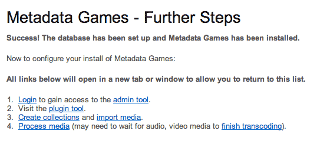
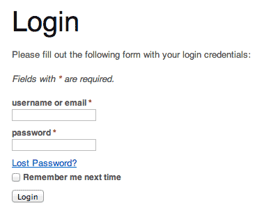
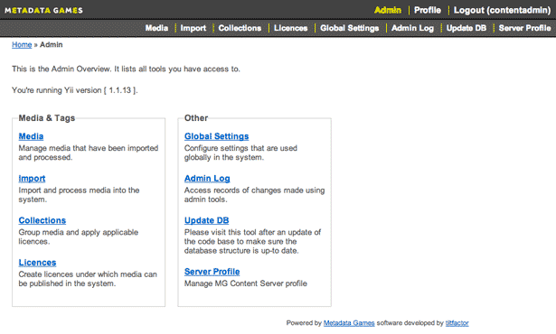
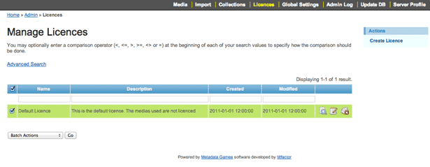
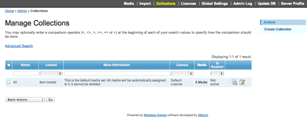
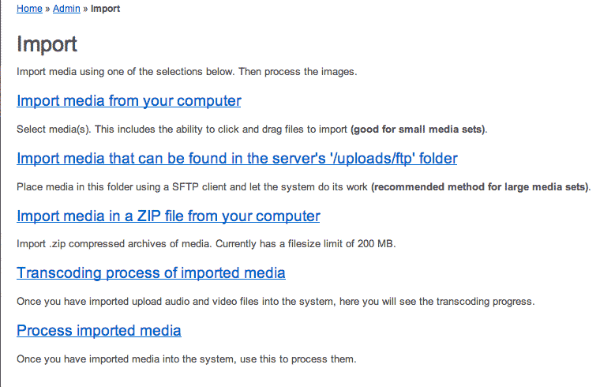
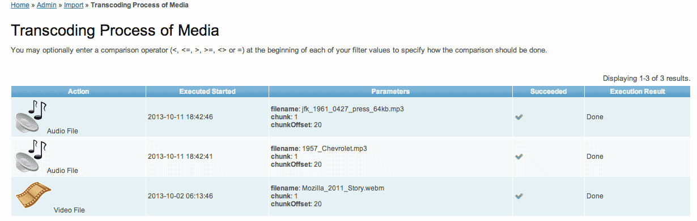

# Configuration #

Once the MG Content App is installed, it's time to configure it:

1. Login to gain access to the admin tool.
2. Create licences to assign to media collections.
3. Create collections and import media.
4. Process media (may need to wait for audio, video media to finish transcoding).




## 1. Login ##

Gain access to the Content App admin tools by signing in with your newly-created account at the login screen.

```
http://CONTENT_APP_URL/www/index.php/user/login
```




You can access the "Admin Overview" page by clicking on "Admin" in the Metadata Games navigation bar at the top of the page. This page contains links to all of the available tools. These links also appear in the Admin navigation bar, underneath the Metadata Games navigation bar.



> __NOTE:__ For detailed information about all admin tools, see the [Site Administration](adminGuide_contentapp.md) guide in the Metadata Games documentation/ folder.


## 2. Create licences to assign to media collections. ##

From the Admin Overview, click __Licences__.



It's highly recommended to create a licence to assign to your collections. Click __Create Licence__. Enter a licence name and the terms in the description textbox. Click __Create__ when finished.


## 3. Create Collections & Import Media ##

Next, create a collection and import media from your server or local machine by using the "Collections" and "Import" tools.



Although not required, we recommend creating a collection. The process is similar to creating a licence.


> __Note:__ Importing media is a __two__-step process: __Import__ and __Process__.

> __NOTE: All images imported into the system must be in the JPEG (.jpg or .jpeg), PNG, or GIF formats. We highly recommend that each image be no larger than 4 MB in size, due to limits in a typical PHP configuration. Furthermore, we recommend that a minimum of 100 images are imported and processed into the system before starting gameplay.)__




See the [Site Administration](adminGuide_contentapp.md) guide in the Metadata Games documentation/ folder for more information.


4.Process media
----------------------------
> __NOTE: Upon import, audio and video media are automatically transcoded and split into 20-second clips. Transcoding must finish before processing. You can view transcoding process from Admin/Import/Transcode page.__



Once your media has been imported or transcoded, click __Import__ / __Process__
* check the collections you would like to put the media into
* at bottom of page, click on __"Selected Media"__ drop-box and select "first 300", then click __Process_Media__

> __Configuration is complete: now to [configure the Game App]((https://github.com/tiltfactor/mg-content/blob/development/documentation/configure_gameapp.md).__

