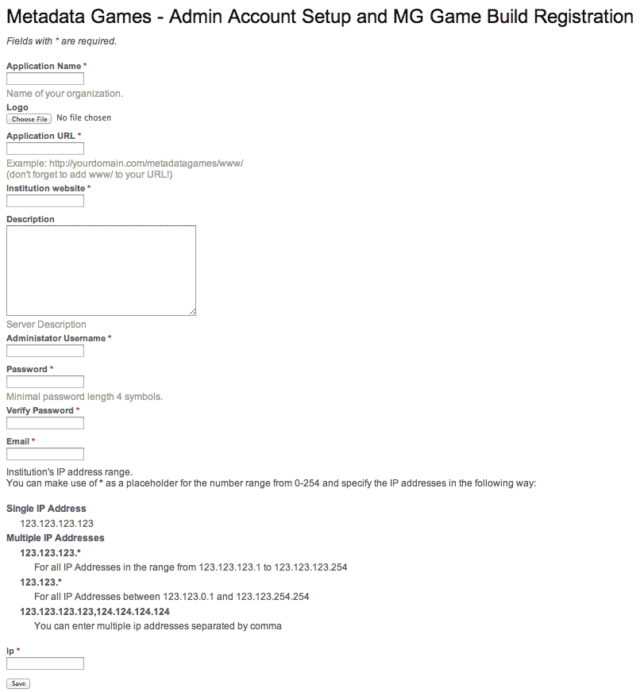

# Installation #

- [Requirements](#requirements)
- [Install Content Build](#install-content-build)
- [Running Content Build over https](#running-content-build-over-https)
- [Troubleshooting](#troubleshooting)

## Requirements ##

###LAMP Stack (linux, apache, mysql, php) ###

We are currently using the following:
* Ubuntu 13.10
* Apache 2.4.6
* PHP 5.5.3
* MySQL 5.5.34


### Other things to install ###

* SSL cert (if you decide to use https://)


### Check PHP Memory Limit ###
Before installation, have a system administrator configure your server's php.ini file to make sure its PHP memory limit is at least 128 MB. We currently recommend 300 MB or more if you are looking to import and use more than 10,000 images or are importing audio and/or video media.

* Modify php.ini file
  * On Ubuntu, you can find this in /etc/php5/apache2/
  * memory_limit - change from 128M to 300M or higher to large image sets, and audio/video media
  * post_max_size - change from 8M to 220M to accommodate larger media
  * upload_max_filesize - change from 2M to 256M to handle audio and video file uploads

* If running PHP 5.5+
  * Must define date.timezone (e.g., date.timezone # "America/New_York")
  * Reload apache


## Install Content Build ##

[Grab source code](../README.md#grabbing-the-game-build-code)

In www/protected/data folder, copy fbvsettings_default.php and save it as fbvsettings.php.

In fbvsettings.php, edit the following line to reflect your current setup:

```
'mg-api-url' => 'http://LOCATION_OF_GAME_BUILD/www/index.php/ws/content/wsdl/',
```


In mg-game folder, go to tools and run fix-perms script.

```
cd tools
./fix-perms.sh
```

>__fix-perms.sh changes group ownership to www-data, which in Ubuntu systems allow the web server access__

The following folders and files need www-data group ownership:
```
assets/
uploads/
protected/runtime/
protected/config/main.php
protected/data/fbvsettings.php
protected/commands/ffmpeg/ffmpeg
protected/commands/ffmpeg/ffprobe
```


Go to web browser and open URL that you have pointed towards your game build.
```
http://CONTENT_BUILD_LOCATION/www/
```

Click "Proceed with system requirement test" to run a test of server capabilities. This will ensure that your server can support the required Yii framework.

> __NOTE:__ Particular directories and files will need to be writable
> by the webserver user. On Debian/Ubuntu systems, this user is
> usually 'www-data' while RedHat and derivatives often use
> 'apache'. The _fix-perms.sh_ script located in the tools/ directory
> may be of help. Please read the code carefully before use!


If your server passes the system requirement test, you may then click __"Proceed with database installation"__, bring you to the Database Setup page.


### Database Setup ###

You will need to fill out the __Database Name, Database User Name, and Database Host Name__ fields for the database you wish to use. If the database has a password, enter this in the Database Password field as well. If you do not have this information, please contact your system administrator. Leave the Database Host Port field blank. If you have not already created a database for use with Metadata Games, please do so now.

After entering the required information, click "Submit".


### Admin Account and Game Build Registration ###
On this page, you will register your Content Build with the Game build and create a Content Build admin account.

At the "Admin Account Setup" page, fill out the following fields:

  * __Application Name__ - Your Institution or Organization's name.

  * __Logo__ - Upload your Institution or Organization's logo. Although you can put in any size logo, a rectangular shaped graphic 120 pixels or less works best.

  * __Application URL__ - URL for your Content Build. __Don't forget to add www/ to the end of your URL!__

  * __Institution Website__ - URL for your institution. In certain games, this is the link players select to find more information about your institution and your collections.

  * __Description__ - A short description (up to 255 characters) about your Institution.

  * __Administrator Username__ - The name of the administrator's account.

  * __Password__ - A password for the administrator's account.

  * __Verify Password__ - Enter the same password, for confirmation.

  * __Email__ - A valid email address for the administrator.

  * __Ip__ - IP range at your organization. This is for restricting access to collections. For more details on restricting collection access, see [Configuration](configure_contentbuild.md).



Then click "Save".

>Congratulations! You have successfully installed the Content Build for Metadata >Games! Now to __[configure and import media](configure_contentbuild.md)!__ and then __[configure the Game Build](https://github.com/tiltfactor/mg-game/tree/development/documentation/configure_gamebuild.md)


## Running Game Build over https ##
If running over https, check that your ServerProfile URL starts with https


## Troubleshooting ##

__Get Error: Internal Server Error when trying to upload media__
* check application.log in protected/runtime/
* check apache log in /var/log/apache2/error.log
** if due to "PHP Fatal error:  Call to undefined function json_encode()"
*** need to install json extension (php 5.5+ issue).
*** sudo apt-get install php5-json


__After entering installation data, I'm taken back to the System Requirements page__
* check that fbvsettings.php has group perms for www-data.

__Trying to transcode audio/video media and I get a 'Invalid data found when processing input:' error__
* make sure that ffmpeg and ffprobe in www/protected/commands/ffmpeg/ are executable by owner and group, ie, should have permissions 754.


